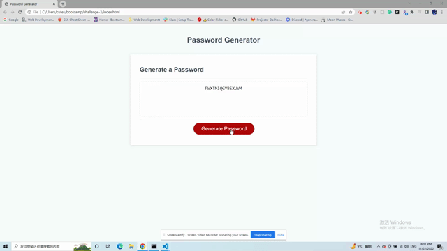

# challenge-3

## Description

This is the UW Boot Camp Week 3 Challenge. Student was asked to create a password generator that meets the user's criteria using JavaScript.

## Usage

When the red "Generate Password" is clicked, the user is prompted to choose password criteria. The user will be able to choose a password length of at least 8 characters and no more than 128 characters. The user will also be able to choose if they want the password to include lowercase letters, uppercase letters, numbers, and special characters. The user will be alerted if they did not select any of the criteria. After selecting the criteria for the password, the page will show the criteria that the user had selected. The password will be displayed in the textbox.

## Visual

## Links

Solution URL: [https://github.com/bettybowie/challenge-3]

Live URL: [https://bettybowie.github.io/challenge-3/]

## License

MIT License
